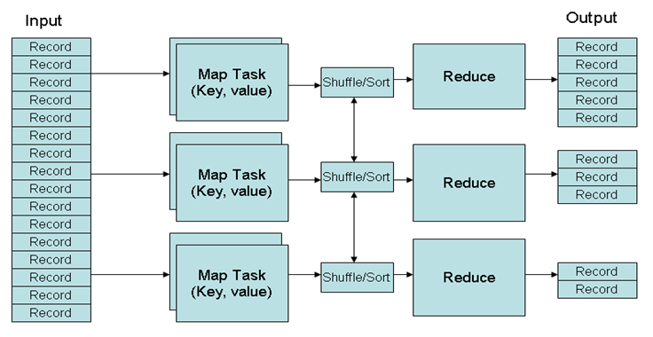

1. Characteristics of big data: (a) volume; (b)variety(different forms); (c) Velocity
2. What data type is structured, semi-structured, or unstructured? Relational dataset is structured, XML, json, and HTML is semi-structured, while plain text and media data is unstructured. Conventional wisdom: only 20% of the data is structured.

3. Mapreduce: 

Mappers: <key, value> --> <key, value>;

Shuffling and Sorting: <key, value> --> <key, <list of values>>

Reducers: <key, <list of values>> --> <key, value>